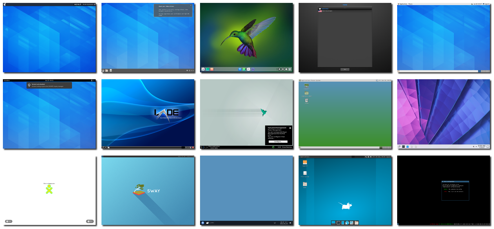

<br/>

<p align="center">
   
   # de_showcase: Desktop Environment Showcase
</p>

# 



<br/>

## What is DE Showcase?

Desktop Environment Showcase is a small project meant to create screenshot of
'stock' configurations of most Linux desktop environments.

It is based on an Arch Linux Vagrant box, and some python scripts to automate
the setup and startup of each desktop environment.

I've built this since those UIs tend to change regularly, but I'm too lazy to
create VMs to try those out regularly, so creating screenshots of the desktop
is a good compromise in my opinion.

<br/>

## What DE am I planning to support?

All the DEs that are listed as 'Officially supported' on the ArchWiki, but also
some window managers (i3, sway…):

<br/>

<details>
<summary> Desktop Environments: </summary>

- [ ] XFCE4
- [ ] snakeware desktop
- [ ] SharpEnviro
- [ ] eXtern-OS desktop
- [ ] Durden desktop environment for the [Arcan](https://www.arcan-fe.com/) Display Server
- [ ] Regolith Desktop Environment
- [ ] jappeOsDesktop
- [ ] CutefishOS
- [ ] VIM-OS(Desktop environment based on VIM only)
- [ ] NightOS(Desktop environment NightOS)
- [ ] Draco Desktop Environment
- [ ] fynedesk(desktop environment for fynedesk-os)
- [ ] Nadva(official desktop environment AvdanOS)
- [ ] lumina
- [ ] jde(some desktop environment in manjaro)
- [ ] Cosmic(popOS)
- [ ] NeXTSTEP
- [ ] Desktop environment for Wayland
- [ ] MoonLightDE
- [ ] mapeo-desktop
- [ ] daedalOS
- [ ] Jade
- [ ] Unity
- [ ] Phosh core
- [ ] Abanu(Desktop Environment for Windows and Linux)
- [ ] Pantheon 
- [ ] TOS Desktop Environment
- [ ] Trinity Desktop Environment
- [ ] Laniakea Desktop Environment
- [ ] AtomOS Desktop Environment
- [x] Budgie
- [x] Cinnamon
- [x] Deepin
- [ ] **WIP** Enlightenment (need to proceed through setup wizard)
- [x] GNOME
- [x] GNOME Flashback
- [x] KDE Plasma
- [x] LXDE (gtk3 version)
- [x] LXQt
- [x] MATE
- [ ] **WIP** Sugar (need to proceed through setup wizard)
- [x] UKUI
- [x] Xfce

</details>

<details>
<summary> Window managers </summary>

- [x] i3
- [x] sway
- [ ] Awesome WM
- [ ] DWM
- [ ] Xmonad
- [ ] ibis
- [ ] bspwm
- [ ] XtermWM
- [ ] 9wm
- [ ] dynamic desktop environment
- [ ] IceWM
- [ ] Spectrwm
- [ ] Openbox
- [ ] Fluxbox
- [ ] herbstluftwm

</details>

## Contribute

I'm open to adding more environments to this list, if it's not too hard to setup
on Arch Linux.

<br/>

## How to generate the `.preview.png` file?

After running `vagrant up` to generate all screenshots, run the following image
magick command:

```bash
montage -geometry 320x240+10+10 -shadow -background none screenshots/*.png .preview.png
```

<br/>

## Contributors
<a href="https://github.com/cafehaine/de_showcase/graphs/contributors">
  
</a>

<br/>
<br/>

## License
- Project is licensed in GPL-3.0 license
- [Flaticon License](https://www.flaticon.com/free-icon/desktop-computer_2704234?term=desktop&page=1&position=15&page=1&position=15&related_id=2704234&origin=search): *Free for personal and commercial use with attribution*
